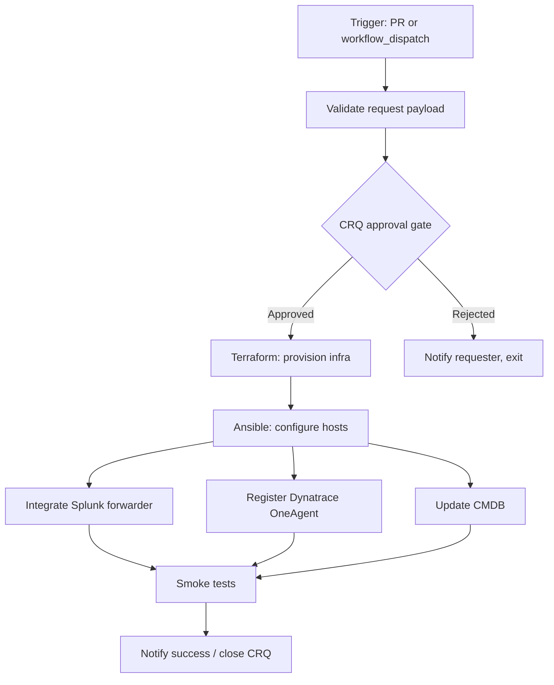

# GitHub Actions — Orchestration Demo

Scaffolded GitHub Actions pipelines built to answer Acme Corporation's orchestration-tool evaluation. The steps in every workflow are simple `echo` scripts — the objective is to **show the orchestration model, not run real work**.

## Customer Driver

Acme Corporation's automation team does not have an orchestration tool today. Current orchestration is manual. They are evaluating:

| Option | Status |
| --- | --- |
| **Terraform Actions** | Under evaluation — wants demo of TF Actions vs Ansible provider |
| **Terraform Stacks** | Customer hinted they want a demo (not built yet) |
| **Ansible Automation Platform (AAP)** | Existing platform; native workflow templates strong for Ansible-heavy orchestration |
| **Jenkins** | **Dismissed** — customer-specific reliability issues (down weekly, ops burden, not team-owned) |
| **GitHub Actions** | Future possibility once GitHub Enterprise Cloud is connected |

> [!NOTE]
> **Recommendation:** GitHub Actions is likely the best fit. TFE alone won't orchestrate the entire workflow (CRQ → provision → config → observability → notify). This demo exists to show the customer what that end-to-end orchestration looks like in GHA.

## The Customer's Three Requirements

The README and the pipelines below are organized around these three questions:

1. **Can parts be re-triggered if they fail?**
   - **Native UI:** "Re-run failed jobs" and "Re-run all jobs" buttons on every run page
   - **State preservation:** outputs and artifacts from successful upstream jobs are kept, so re-running starts from the failure point — not from scratch
   - **Demo:** `orchestration-primitives.yml`

2. **Can you see the order in which things happened visually?**
   - **Job DAG view:** the Actions tab renders every workflow as a graph — boxes for jobs, arrows for `needs:` dependencies, color-coded by status
   - **Demo:** `saas-onboarding.yml` exercises this with steps that fan out and converge

3. **Can you chain processes serially and in parallel?**
   - **Serial:** `needs: [upstream-job]` declares a dependency
   - **Parallel:** any two jobs without a `needs:` chain between them run concurrently
   - **Fan-out:** matrix strategy (`strategy.matrix:`) spawns parallel job instances
   - **Fan-in:** a downstream job with `needs: [a, b, c]` blocks until all complete

## What Each Pipeline Demonstrates

### 1. `saas-onboarding.yml` — Flagship End-to-End Demo

Mirrors Acme's actual workflow: **CRQ approval → Terraform provision → Ansible configure → observability integration (Splunk + Dynatrace, in parallel) → notify**. Demonstrates all three of the customer's questions in a single realistic run. The graph view of this workflow is the strongest visual proof.

### 2. `orchestration-primitives.yml` — Pattern Reference

Bite-sized demonstration of each orchestration primitive in isolation:
- Sequential jobs (`needs:`)
- Parallel jobs (no `needs:` between them)
- Fan-out via matrix (`strategy.matrix`)
- Fan-in (downstream `needs: [a, b, c]`)
- Per-step retry (`continue-on-error` + manual re-run, or third-party retry action)
- Conditional execution (`if:`)

### 3. `manual-approval-gates.yml` — CRQ-Style Approval

Models the CRQ approval step. Uses GitHub Actions **environments** with required reviewers to pause a workflow until an approver clicks "Approve". This is the natural fit for change-management gates and ServiceNow CRQ-equivalent approvals.

## Folder Layout

```
github-actions-orchestration/
├── README.md                     # This file
└── .github/
    └── workflows/
        ├── saas-onboarding.yml
        ├── orchestration-primitives.yml
        └── manual-approval-gates.yml
```

The `.github/workflows/` layout matches what GitHub expects, so the demo can be dropped into any repo and runs immediately.

## Run Tasks vs Actions vs AAP Kickoff — Decision Matrix

| Need | Use |
| --- | --- |
| **Inline policy / compliance check during a Terraform run** | **TFE Run Tasks** (Sentinel, OPA, Checkov, etc.) |
| **Outside-of-Terraform action triggered by a run state (e.g., on policy pass, on apply complete)** | **Terraform Actions** (when GA) or webhook → orchestrator |
| **End-to-end workflow that spans Terraform + Ansible + ITSM + observability** | **GitHub Actions** (this demo) |
| **Config management on already-provisioned hosts (drift, patching)** | **AAP** (its native job) |
| **Long-running, stateful workflow that survives restarts** | **GHA with `workflow_dispatch` + reusable workflows** |

## Sample Workflow — SaaS Onboarding



The serial path is `validate → CRQ → provision → configure`. The integration steps (Splunk, Dynatrace, CMDB) run in **parallel** after configuration. The final notification step fans in once all three integrations are healthy.

## How to Run This Demo

1. Fork or clone this repo.
2. In **Settings → Environments**, create three environments and add required reviewers to each:
   - `change-approval` — used by `saas-onboarding.yml` as the CRQ gate
   - `staging-approval` — used by `manual-approval-gates.yml`
   - `production-approval` — used by `manual-approval-gates.yml`
3. Open the **Actions** tab. Pick a workflow on the left, click **Run workflow**, and watch the graph render.
4. To demo the failed-job re-run pattern: run `Orchestration Primitives` with `force_fail_retry_demo` set to `true`, let it fail, then click **Re-run failed jobs**.
