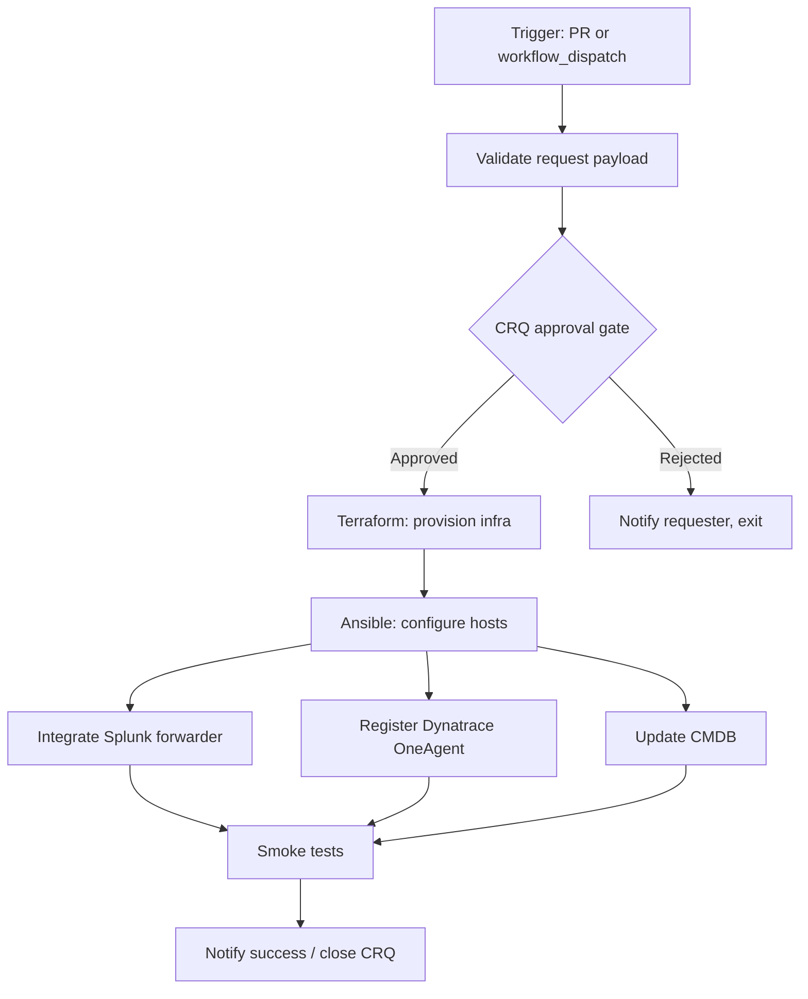

# GitHub Actions — Orchestration Demo

Scaffolded GitHub Actions pipelines built to answer Acme Corporation's orchestration-tool evaluation. The steps in every workflow are simple `echo` scripts — the objective is to **show the orchestration model, not run real work**.

## Customer Driver

Acme Corporation's automation team does not have an orchestration tool today. Current orchestration is manual. They are evaluating:

| Option | Status |
| --- | --- |
| **Terraform Actions** | Under evaluation — wants demo of TF Actions vs Ansible provider |
| **Terraform Stacks** | Customer hinted they want a demo (not built yet) |
| **Ansible Automation Platform (AAP)** | Existing platform; native workflow templates strong for Ansible-heavy orchestration |
| **Jenkins** | **Dismissed** — customer-specific reliability issues (down weekly, ops burden, not team-owned) |
| **GitHub Actions** | Future possibility once GitHub Enterprise Cloud is connected |

> [!NOTE]
> **Recommendation:** GitHub Actions is likely the best fit. TFE alone won't orchestrate the entire workflow (CRQ → provision → config → observability → notify). This demo exists to show the customer what that end-to-end orchestration looks like in GHA.

## The Customer's Three Requirements

The README and the pipelines below are organized around these three questions:

1. **Can parts be re-triggered if they fail?**
   - **Native UI:** "Re-run failed jobs" and "Re-run all jobs" buttons on every run page
   - **State preservation:** outputs and artifacts from successful upstream jobs are kept, so re-running starts from the failure point — not from scratch
   - **Demo:** run `execute-deployment.yml` with `inject_failure: splunk-integrate`. Splunk fails on attempt 1, dynatrace and cmdb stay green, smoke-tests is skipped. Click **Re-run failed jobs** — attempt 2 skips the injection guard (`github.run_attempt == 1` is now false), splunk succeeds, and downstream proceeds. Terraform, ansible, dynatrace, and cmdb are NOT re-run — their original outcome is preserved.

2. **Can you see the order in which things happened visually?**
   - **Job DAG view:** the Actions tab renders every workflow as a graph — boxes for jobs, arrows for `needs:` dependencies, color-coded by status
   - **Demo:** `execute-deployment.yml` exercises this with steps that fan out and converge

3. **Can you chain processes serially and in parallel?**
   - **Serial:** `needs: [upstream-job]` declares a dependency
   - **Parallel:** any two jobs without a `needs:` chain between them run concurrently
   - **Fan-out:** matrix strategy (`strategy.matrix:`) spawns parallel job instances
   - **Fan-in:** a downstream job with `needs: [a, b, c]` blocks until all complete

## What the Pipeline Demonstrates

### `execute-deployment.yml`

- **Workflow:** validate → change-management gate (per-environment) → Terraform provision → Ansible configure → Splunk + Dynatrace + CMDB (parallel) → smoke tests → mark CR deployed → notify
- **Per-environment gate behavior:**
  - **sandbox** → GitHub Actions environment-gate with 1 human reviewer in the Actions UI. No change request is created.
  - **staging** → The workflow **auto-creates a change request issue** (labeled `change-request` + `status:approved` + `env:staging`). The webapp shows it; the deploy proceeds immediately. The CR is for audit/record.
  - **production** → The workflow **requires an existing approved CR** (provided via `change_request_id` input). It verifies the issue has labels `change-request` + `status:approved` + `env:production` and fails fast otherwise. Approval is performed in the webapp.
- **Mark-deployed:** after smoke-tests succeed, the CR is re-labeled `status:deployed` and the run links to the issue via a comment.
- **Failure injection:** the `inject_failure` input forces a chosen stage (`terraform-provision`, `ansible-configure`, or `splunk-integrate`) to exit non-zero **on attempt 1 only**. Click **Re-run failed jobs** → attempt 2 skips the injection guard → workflow succeeds. Demonstrates state preservation across retries.

## Change Management Webapp

Live at: **https://cube-earth-labs.github.io/github-actions-orchestration/**

A mock change-management system, served from `docs/index.html` via GitHub Pages. Backed by GitHub Issues (each CR is an issue labeled `change-request` + `status:*` + `env:*`). Lets you:

- Create a change request (title, description, environment)
- Approve / reject pending CRs
- See history of deployed CRs

**Auth:** the webapp uses a GitHub Personal Access Token (PAT) with `repo` scope, stored in `localStorage`. Reads work anonymously; create/approve actions need a PAT. [Create one →](https://github.com/settings/tokens/new?scopes=repo&description=cube-earth-labs%20CMS%20demo)

## Folder Layout

```
github-actions-orchestration/
├── README.md                     # This file
├── docs/
│   └── index.html                # Change-management webapp (served by deploy-pages.yml)
└── .github/
    └── workflows/
        ├── execute-deployment.yml    # Flagship orchestration demo
        └── deploy-pages.yml          # Publishes docs/ to GitHub Pages
```

## Run Tasks vs Actions vs AAP Kickoff — Decision Matrix

| Need | Use |
| --- | --- |
| **Inline policy / compliance check during a Terraform run** | **TFE Run Tasks** (Sentinel, OPA, Checkov, etc.) |
| **Outside-of-Terraform action triggered by a run state (e.g., on policy pass, on apply complete)** | **Terraform Actions** (when GA) or webhook → orchestrator |
| **End-to-end workflow that spans Terraform + Ansible + ITSM + observability** | **GitHub Actions** (this demo) |
| **Config management on already-provisioned hosts (drift, patching)** | **AAP** (its native job) |
| **Long-running, stateful workflow that survives restarts** | **GHA with `workflow_dispatch` + reusable workflows** |

## Sample Workflow — Execute Deployment



The serial path is `validate → CRQ → provision → configure`. The integration steps (Splunk, Dynatrace, CMDB) run in **parallel** after configuration. The final notification step fans in once all three integrations are healthy.

## How to Run This Demo

### One-time setup

1. In **Settings → Environments**, create the `change-approval` environment with a required reviewer — used as the sandbox gate in `execute-deployment.yml`.
2. Open the webapp at https://cube-earth-labs.github.io/github-actions-orchestration/ and paste your GitHub PAT in **Settings**. Labels (`change-request`, `status:*`, `env:*`) are already created in the repo.

### Sandbox deploy (no change request)

1. Actions → **Execute Deployment** → **Run workflow** → environment: `sandbox`
2. Fill in: `change_title` and `change_description` (required for every environment).
3. The `sandbox-approval` job pauses with a "Waiting" status. Click **Review deployments** → Approve.
4. Pipeline proceeds to terraform → ansible → integrations → smoke → notify.

### Staging deploy (auto-creates a change request)

1. Actions → **Execute Deployment** → **Run workflow** → environment: `staging`
2. Fill in: `change_title` and `change_description` (these populate the new CR).
3. Pipeline immediately creates a CR (status:approved), then deploys. After smoke-tests, the CR is marked `status:deployed`.
4. Open the webapp to see the CR appear in **Approved** → then move to **Deployed** after the run completes.

### Production deploy (requires an approved CR from the webapp)

1. **In the webapp:** create a CR with environment = `production`. It enters **Pending Approval**.
2. **In the webapp:** click **Approve** on that CR. It moves to **Approved**.
3. **Note the issue number** (e.g., `#42`).
4. Actions → **Execute Deployment** → **Run workflow** → environment: `production`, `change_request_id: 42`, plus `change_title` and `change_description`.
5. The `production-verify-cr` job fetches the issue and validates its labels. If approved + production, the pipeline proceeds. If not, it fails fast with a clear message.
6. After smoke-tests, the CR is marked `status:deployed`.

### Demo the Re-run failed jobs pattern

Run `Execute Deployment` with `inject_failure: splunk-integrate`. Splunk turns red on attempt 1, dynatrace and cmdb stay green, smoke-tests is skipped. Click **Re-run failed jobs** in the top-right of the run page → attempt 2 skips the injection guard → splunk succeeds → downstream proceeds. Only the failed job and its skipped downstream re-execute; the parallel siblings (dynatrace, cmdb) keep their original-run outcome.
